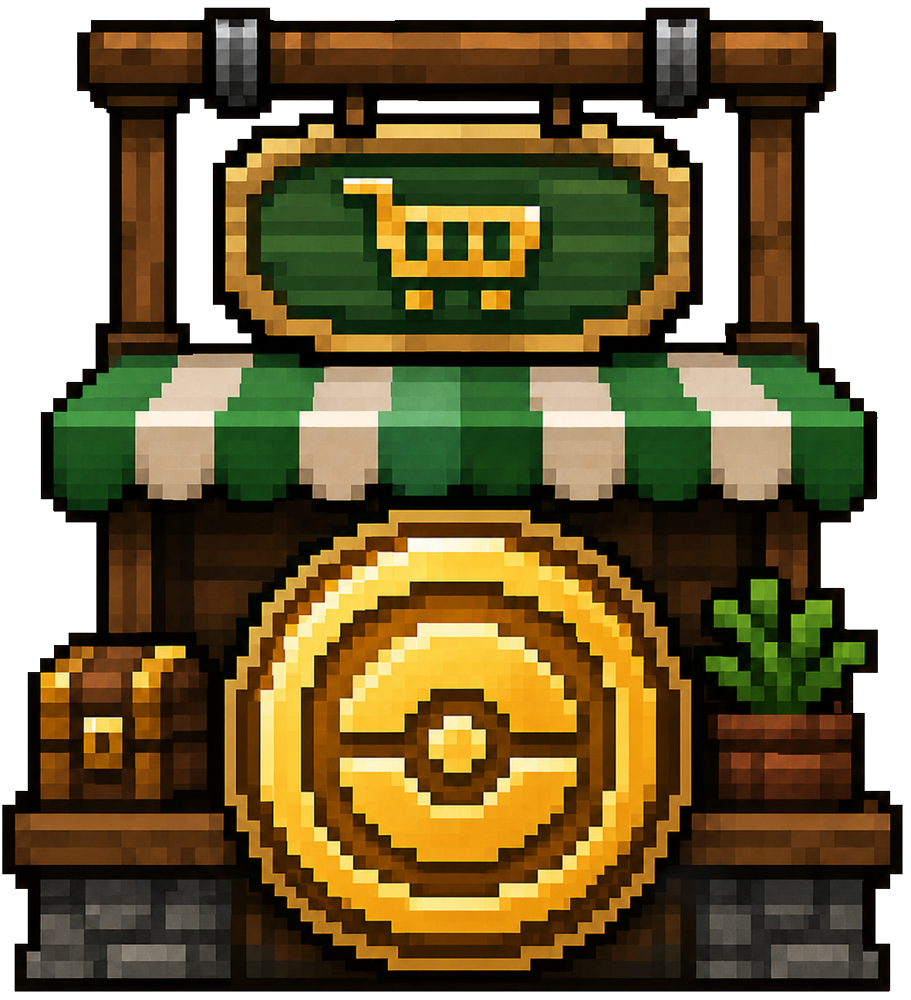

# CobbleDollars Command Shops

<p align="center">
  
</p>

Server-side NeoForge addon for CobbleDollars on Minecraft `1.21.1`.

This mod adds command-driven CobbleDollars shops with:
- persistent per-player stock
- configurable global or per-shop banks
- exact matching through `match.include` / `match.exclude` with `item`, `stack`, `tag`, and `mod`
- conditional visibility and access rules
- runtime shop visibility toggles through commands
- optional purchase bonuses when buying enough bundles in one transaction
- structured audit logs for buys, sells, and visibility changes
- hot config reload with `/cdshops reload`
- configurable server-only player feedback through `feedback.json`
- optional client-side UI enhancements when the same jar is installed on the client
- built-in English and French localized feedback

It does not replace CobbleDollars, replace CobbleDollars NPCs, or move gameplay authority to the client. It only takes over sessions opened through this addon.

## Commands

Public commands:

- `/cdshops open <shop>`
- `/cdshops list`
- `/cdshops visibility list`

Admin commands (`permission level 2`):

- `/cdshops open <shop> <targets>`
- `/cdshops reload`
- `/cdshops restock <shop> all <players>`
- `/cdshops restock <shop> offer <offer> <players>`
- `/cdshops stock <shop> <player>`
- `/cdshops visibility <shop> status`
- `/cdshops visibility <shop> enable`
- `/cdshops visibility <shop> disable [message]`
- `/cdshops where`
- `/cdshops stats summary [window]`
- `/cdshops stats top <shops|offers|players|items> [window] [limit]`
- `/cdshops stats shop <shop> [window]`
- `/cdshops stats player <player|uuid> [window]`
- `/cdshops stats item <item> [window]`

## Config

Runtime config files are loaded from:

`config/cobbledollarscommandshops/`

On first server start, the mod generates the default config tree:

```text
config/cobbledollarscommandshops/
  CONFIG_GUIDE.md
  audit.json
  feedback.json
  global_bank.json
  shops/
    general_store/
      shop.json
    blacksmith/
      shop.json
    explorer/
      shop.json
    syntax_showcase/
      shop.json
      bank.json
```

The detailed format reference is available in the repository at:

`docs/CONFIG_GUIDE.md`

The same guide is also generated at runtime in:

`config/cobbledollarscommandshops/CONFIG_GUIDE.md`

Audit logs are written to:

`logs/cobbledollarscommandshops/audit.jsonl`

## Benchmark Configs

The repository also ships a standalone heavy benchmark pack in:

`bench-configs/heavy_shop_bank/`

It is intentionally kept out of the runtime config tree. Copy it into `config/cobbledollarscommandshops/shops/` only when you want to run manual performance tests.

License terms are in the root `LICENSE` file and are also bundled into the built jar.

## Build

`gradlew build`
